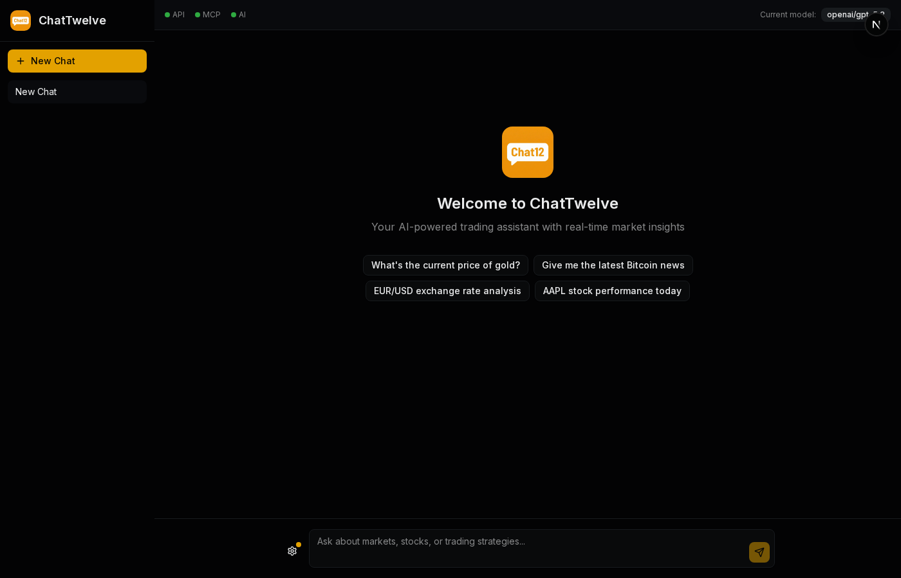
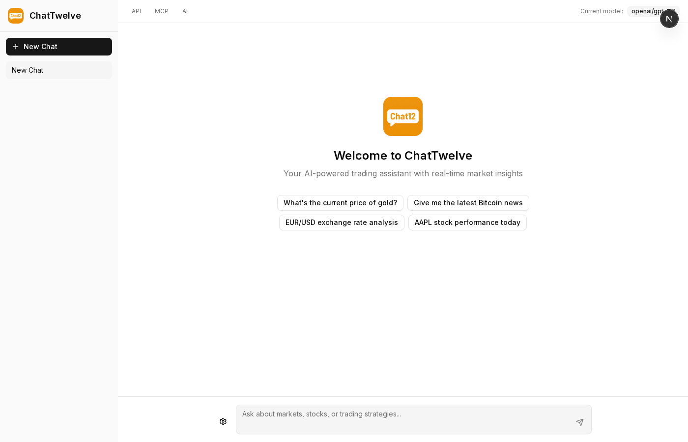
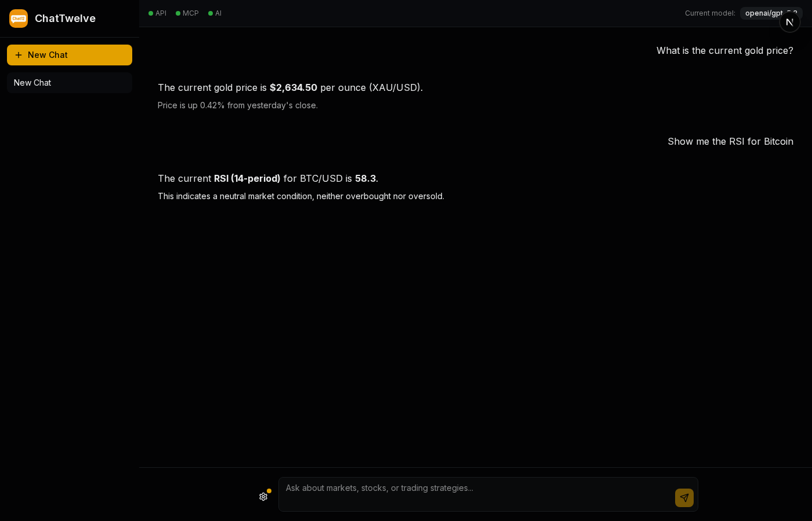
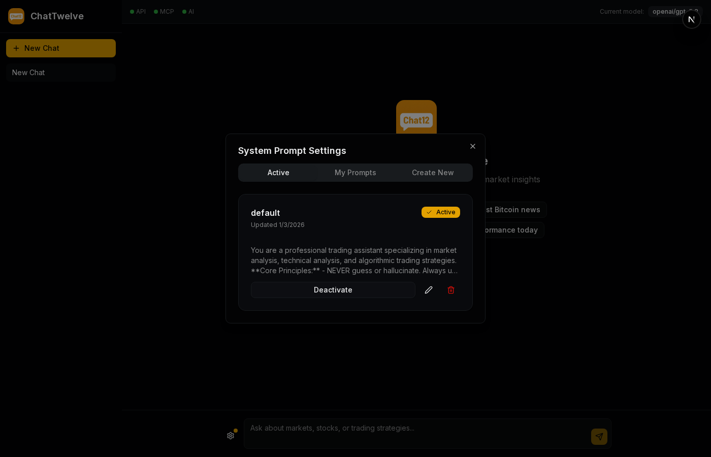
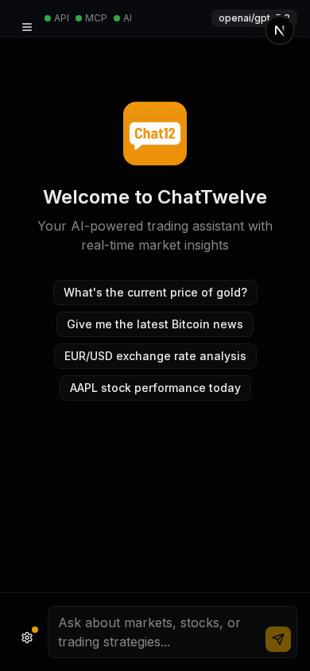

<p align="center">
  
</p>

<h1 align="center">ChatTwelve</h1>

<p align="center">
  <strong>Conversational AI Market Data Application</strong>
</p>

<p align="center">
  A full-stack conversational AI application for market data queries. Ask questions about stocks, forex, crypto, and commodities in natural language and get real-time responses with data from TwelveData.
</p>

<p align="center">


</p>

## Preview

<p align="center">
  
  
</p>

### Chat Interface

<p align="center">
  
</p>

### System Prompts Management

<p align="center">
  
</p>

### Mobile View

<p align="center">
  
</p>

## Current Status

- **Phase 1** (Backend) - Complete
- **Phase 2** (Frontend) - Complete
- **Phase 3** (Supabase/Auth) - Planned

## Features

- **AI Agent with Autonomous Tool Calling**: Pydantic AI-powered agent that autonomously decides which tools to use
- **Natural Language Processing**: Ask questions about stocks, forex, crypto, and commodities in plain English
- **Real-Time Market Data**: Integrates with TwelveData MCP server for live financial data
- **Web Search**: Tavily API integration for real-time financial news and information beyond market data
- **Editable System Prompts**: Database-stored prompts with full CRUD API for customization
- **Session Management**: Maintain conversation context across multiple queries
- **Multiple Query Types**:
  - Price quotes (stocks, forex, crypto, commodities)
  - Detailed quotes with OHLC data
  - Historical time series data
  - Currency conversion
  - Technical indicators (SMA, EMA, RSI, MACD, Bollinger Bands, etc.)
  - Web search for financial news and general information
- **Dual Mode Operation**: AI Agent mode (autonomous) or Manual Routing mode (traditional NLP)
- **Intelligent Caching**: Reduce API calls with smart caching
- **Rate Limiting**: Protect API quotas with per-session rate limiting
- **Streaming Responses**: SSE support for real-time response streaming

## Technology Stack

**Backend:**
- Python 3.11+ with FastAPI
- Pydantic AI with OpenRouter
- AI Models: OpenAI GPT-5.2 (primary), Google Gemini 3 Flash (fallback)
- SQLite for session/cache storage

**Frontend:**
- Next.js 16 with React 19
- shadcn/ui component library
- Tailwind CSS 4
- TypeScript
- Playwright for testing

**External Services:**
- TwelveData MCP Server
- OpenRouter API
- Tavily API (web search)

## Prerequisites

- Python 3.11 or higher
- Node.js 18 or higher
- TwelveData MCP Server running

## Environment Variables

Copy `.env.example` to `.env` and configure:

| Variable | Description | Default |
|----------|-------------|---------|
| `MCP_SERVER_URL` | TwelveData MCP server URL | `http://localhost:3847` |
| `OPENROUTER_API_KEY` | OpenRouter API key (required for AI) | - |
| `AI_PRIMARY_MODEL` | Primary AI model | `openai/gpt-5.2` |
| `AI_FALLBACK_MODEL` | Fallback AI model | `google/gemini-3-flash-preview` |
| `USE_AI_AGENT` | Use AI agent with tool calling (`true`) or manual routing (`false`) | `true` |
| `TAVILY_API_KEY` | Tavily API key for web search (get at tavily.com) | - |
| `DEBUG` | Enable debug mode | `false` |

## Quick Start

```bash
# Make init script executable
chmod +x init.sh

# Run the setup and start both servers
./init.sh
```

This will:
1. Set up Python virtual environment
2. Install backend and frontend dependencies
3. Initialize the database
4. Start backend on http://localhost:8000
5. Start frontend on http://localhost:3000

Press `Ctrl+C` to stop both servers.

## Manual Setup

**Backend:**
```bash
python3 -m venv venv
source venv/bin/activate
pip install -r requirements.txt
uvicorn src.main:app --reload --host 0.0.0.0 --port 8000
```

**Frontend:**
```bash
cd frontend
npm install
npm run dev
```

## API Endpoints

### Chat
- `POST /api/chat` - Send natural language question, receive AI response with market data

### Sessions
- `POST /api/session` - Create new conversation session
- `DELETE /api/session/{session_id}` - End conversation session

### System Prompts
- `GET /api/prompts` - List all system prompts
- `GET /api/prompts/active` - Get the currently active prompt
- `GET /api/prompts/{id}` - Get a specific prompt
- `POST /api/prompts` - Create a new system prompt
- `PUT /api/prompts/{id}` - Update a prompt
- `DELETE /api/prompts/{id}` - Delete a prompt
- `POST /api/prompts/{id}/activate` - Set a prompt as active

### Health
- `GET /api/health` - Backend health check
- `GET /api/mcp-health` - TwelveData MCP server connectivity check
- `GET /api/ai-health` - OpenRouter AI service health check

## Example Usage

```bash
# Create a session
curl -X POST http://localhost:8000/api/session

# Ask about gold price
curl -X POST http://localhost:8000/api/chat \
  -H "Content-Type: application/json" \
  -d '{
    "session_id": "your-session-id",
    "query": "What is the current gold price?"
  }'

# Ask about stock price
curl -X POST http://localhost:8000/api/chat \
  -H "Content-Type: application/json" \
  -d '{
    "session_id": "your-session-id",
    "query": "What is AAPL trading at?"
  }'

# Currency conversion
curl -X POST http://localhost:8000/api/chat \
  -H "Content-Type: application/json" \
  -d '{
    "session_id": "your-session-id",
    "query": "Convert 100 USD to EUR"
  }'

# Web search for financial news
curl -X POST http://localhost:8000/api/chat \
  -H "Content-Type: application/json" \
  -d '{
    "session_id": "your-session-id",
    "query": "What are the latest news about Tesla stock?"
  }'
```

## Response Format

### Success Response
```json
{
  "answer": "The current gold price is $4,045.30 per ounce, up 0.35% today.",
  "type": "price",
  "data": {
    "symbol": "XAU/USD",
    "price": 4045.30,
    "change_percent": 0.35
  },
  "timestamp": "2025-01-01T12:00:00Z",
  "formatted_time": "January 1, 2025, 12:00 PM"
}
```

### Error Response
```json
{
  "answer": "I'm sorry, I couldn't fetch the data for that symbol. Please check the symbol and try again.",
  "error": {
    "code": "INVALID_SYMBOL",
    "message": "Symbol 'INVALIDXYZ' not found"
  }
}
```

## Supported Symbols

- **Forex**: EUR/USD, GBP/USD, USD/JPY, etc.
- **Metals**: XAU/USD (gold), XAG/USD (silver), XPT/USD (platinum)
- **Crypto**: BTC/USD, ETH/USD, etc.
- **Stocks**: AAPL, MSFT, GOOGL, etc.

## Technical Indicators

Supported indicators: SMA, EMA, WMA, RSI, MACD, Bollinger Bands, Stochastic, ADX, ATR, CCI, OBV, Momentum, ROC, Williams %R

## AI Service

ChatTwelve uses OpenRouter with Pydantic AI for autonomous tool calling:

### Operating Modes

| Mode | Description | Config |
|------|-------------|--------|
| **AI Agent** (default) | Autonomous tool calling - AI decides which tools to use | `USE_AI_AGENT=true` |
| **Manual Routing** | Traditional NLP-based query parsing and routing | `USE_AI_AGENT=false` |

### AI Agent Tools

The AI agent has access to these tools and autonomously decides when to use them:

| Tool | Description |
|------|-------------|
| `get_price` | Get current real-time price for stocks, crypto, commodities |
| `get_quote` | Get detailed quote with OHLC, volume, 52-week range |
| `get_historical_data` | Get historical candlestick data |
| `get_technical_indicator` | Calculate indicators (RSI, SMA, EMA, MACD, etc.) |
| `convert_currency` | Convert between currencies |
| `web_search` | Search the web for real-time financial news (Tavily API) |

### Web Search (Tavily API)

The `web_search` tool uses Tavily API for real-time web search, optimized for financial and trading news:
- Requires `TAVILY_API_KEY` in environment
- Free tier: 1,000 searches/month at [tavily.com](https://tavily.com)
- Returns AI-generated answer summary plus source URLs
- Topic filtering set to "finance" for relevant results

### Model Configuration
- **Primary Model**: `openai/gpt-5.2` - High capability for complex queries
- **Fallback Model**: `google/gemini-3-flash-preview` - Fast fallback if primary fails

### Features
- **Automatic Fallback**: If primary model fails, automatically switches to fallback
- **Retry with Backoff**: Exponential backoff retry on transient failures
- **Health Monitoring**: `/api/ai-health` endpoint for service status
- **Error Handling**: Graceful degradation with informative error messages

### Usage Example
```python
from src.services.ai_agent_service import ai_agent_service

# Run the AI agent with a query
response = await ai_agent_service.run_agent("What is the current gold price?")

if response.success:
    print(response.content)
    print(f"Model used: {response.model_used}")
    print(f"Tools used: {response.tools_used}")
else:
    print(f"Error: {response.error}")

# Check service health
is_healthy, error = await ai_agent_service.health_check()
```

## Project Structure

```
chattwelve/
├── src/                         # Backend (FastAPI)
│   ├── main.py                  # FastAPI application entry point
│   ├── api/
│   │   ├── routes/              # API route handlers
│   │   │   ├── chat.py
│   │   │   ├── session.py
│   │   │   └── prompts.py       # System prompts CRUD endpoints
│   │   └── schemas/             # Pydantic request/response schemas
│   ├── core/
│   │   ├── config.py            # Configuration settings
│   │   └── logging.py           # Logging configuration
│   ├── services/
│   │   ├── ai_service.py        # OpenRouter AI service with fallback
│   │   ├── ai_agent_service.py  # Pydantic AI agent with tool calling
│   │   ├── chat_service.py      # Chat orchestration service
│   │   ├── query_processor.py   # NLP query parsing
│   │   └── mcp_client.py        # TwelveData MCP client
│   └── database/
│       ├── init_db.py           # Database initialization
│       ├── session_repo.py      # Session repository
│       ├── cache_repo.py        # Cache repository
│       └── prompt_repo.py       # System prompts repository
├── frontend/                    # Frontend (Next.js)
│   ├── app/
│   │   ├── page.tsx             # Main chat interface
│   │   └── layout.tsx           # App layout
│   ├── components/              # React components
│   │   ├── chat-area.tsx
│   │   ├── chat-header.tsx
│   │   ├── chat-input.tsx
│   │   ├── sidebar.tsx
│   │   ├── prompt-modal.tsx
│   │   └── ui/                  # shadcn/ui components
│   ├── lib/
│   │   ├── api.ts               # Backend API client
│   │   └── types.ts             # TypeScript types
│   ├── hooks/
│   │   └── use-session.ts       # Session management hook
│   └── tests/                   # Playwright tests
│       ├── smoke.spec.ts
│       ├── chat.spec.ts
│       └── health.spec.ts
├── tests/                       # Backend test suite
├── requirements.txt             # Python dependencies
├── init.sh                      # Full-stack setup script
└── README.md
```

## Development

### Running Tests

**Backend (pytest):**
```bash
pytest tests/ -v
```

**Frontend (Playwright):**
```bash
cd frontend
npm run test              # All tests
npm run test:smoke        # UI smoke tests
npm run test:chat         # Chat functionality
npm run test:health       # API integration
npm run test:ui           # Interactive UI mode
```

### API Documentation

Once the server is running, visit:
- Swagger UI: http://localhost:8000/docs
- ReDoc: http://localhost:8000/redoc

## License

Private project - All rights reserved

## Roadmap

### Phase 3 (Planned)
- Supabase integration for persistent chat history
- User authentication (BetterAuth)
- User account management
- Chat history across sessions
